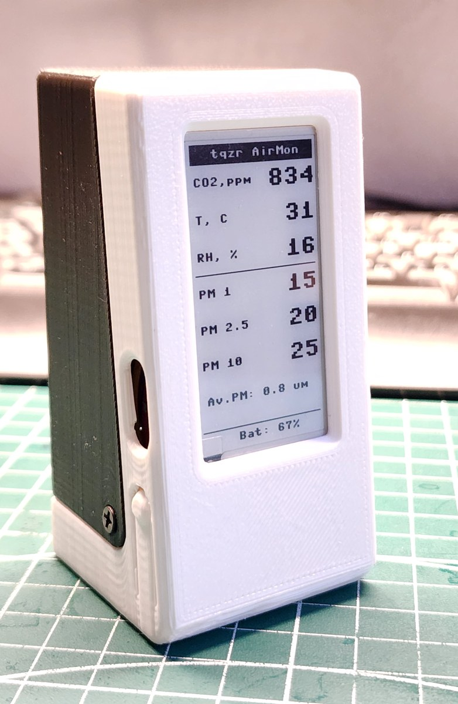
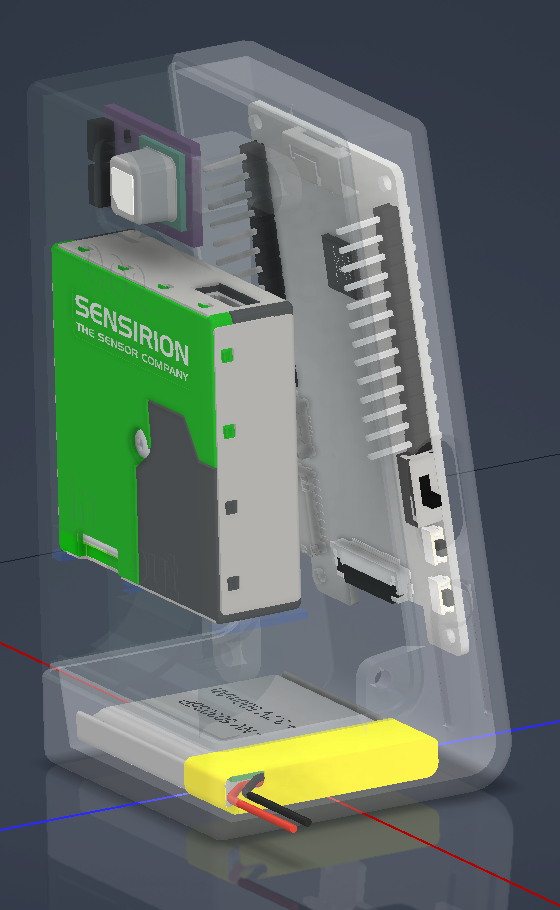

# sps30-scd41-air-monitor

**A desk box that tells you when to open a window, and whether the air you just stirred up has settled. Seven numbers on e-paper, no app and no cloud.**

[](https://github.com/ashbmstu/sps30-scd41-air-monitor/actions/workflows/ci.yml)
[](LICENSE)


Two Sensirion sensors on a LILYGO TTGO T5: an **SCD41** measuring carbon dioxide,
temperature and humidity, and an **SPS30** counting particulates. The 2.13-inch
e-paper panel redraws every thirty seconds and holds the last reading with the
power off, so the box is readable across a room and looks like a label rather
than a screen.

It does not connect to anything. The board has Wi-Fi; this firmware never
switches the radio on.

<p align="center">
  
</p>

## What it shows

| | |
|---|---|
| **Carbon dioxide** | ppm, from the SCD41's NDIR sensor |
| **Temperature and humidity** | °C and %RH, from the same sensor |
| **Particulates** | PM1, PM2.5 and PM10 in µg/m³, plus the average particle size in µm |
| **Battery** | Percentage, estimated from the cell voltage |
| **Refresh** | Every 30 seconds, showing the mean of the readings since the last redraw rather than the latest sample |
| **Size** | 46 × 90 × 44 mm, standing upright |

## What you need

| Part | Approx. |
|------|--------|
| LILYGO TTGO T5 V2.3, 2.13-inch e-paper | ~£20 |
| Sensirion SCD41 breakout | ~£25 |
| Sensirion SPS30 | ~£35 |
| Li-ion cell, LP603030 (about 500 mAh) with a JST connector | ~£5 |
| Printed case, four M3 screws | |

Eight wires and no circuit board. The e-paper, the button and the battery
charger are all already on the T5. Full detail in [docs/hardware.md](docs/hardware.md).

> [!WARNING]
> **The SPS30 runs on 5 V, and the board only has 5 V while USB is plugged in.**
> On battery the fan stops and the three PM rows are replaced by `SPS OFF
> (Battery)`. CO2, temperature and humidity keep working. This is a property of
> the hardware, not a fault, and it is what makes the battery useful — see
> [calibration](docs/measurement.md#calibrating-the-co2-sensor).

## Quick start

1. **Put MicroPython on the board.** Plug the T5 in and follow
   [docs/flashing.md](docs/flashing.md). Once only, about five minutes.
2. **Copy the `src` folder onto the board.** Everything inside it, keeping the
   `sensor_pack_2` folder as a folder.
3. **Wire up the two sensors.** Four wires each. The diagram in
   [docs/hardware.md](docs/hardware.md) shows every one.
4. **Print the case** from [Thingiverse](https://www.thingiverse.com/thing:7273904).
5. **Plug in the USB cable.** The splash screen appears, and the first full
   reading lands about thirty seconds later.

The CO2 reading will be wrong for the first day or two until the sensor has seen
fresh air. [docs/measurement.md](docs/measurement.md#calibrating-the-co2-sensor)
explains how to fix that in twenty minutes instead.

## Reading the numbers

**Carbon dioxide** is really a proxy for ventilation: it is mostly you, breathing.

| CO2, ppm | What it means |
|---|---|
| **400 – 600** | Outdoor air, or a room with a window open |
| **600 – 1000** | Normal occupied room. Nothing to do |
| **1000 – 1400** | Stuffy. Ventilation is not keeping up |
| **1400 – 2000** | Noticeably close. This is where people report headaches and dullness |
| **2000 +** | Open something now |

**PM2.5** is the fraction small enough to reach deep into the lungs, and the
number to watch. The bands below are the US EPA's air-quality categories.

| PM2.5, µg/m³ | |
|---|---|
| **0 – 12** | Good |
| **12 – 35** | Moderate |
| **35 – 55** | Unhealthy for sensitive people |
| **55 +** | Unhealthy |

Indoors these move fast and for obvious reasons: frying, toasting, a candle,
vacuuming, a 3D printer, or someone walking across a carpet. Watching a spike
decay tells you more about a room than any single reading does.

## What you can use it for

- **Knowing when to open a window**, instead of guessing. A closed bedroom with
  the door shut passes 1500 ppm overnight surprisingly often.
- **Seeing whether an air purifier actually does anything.** Make some smoke,
  watch PM2.5, turn the purifier on, watch it come down. If the curve does not
  bend, the filter is spent or the machine is too small for the room.
- **Cooking and cleaning.** Frying and vacuuming both spike PM2.5; the useful
  question is how long it takes to fall again with the extractor on versus off.
- **3D printing and soldering** in the same room you sit in.
- **Checking a meeting room** before a long meeting rather than after it.

## How it works

```
SCD41 ──I²C, 100 kHz──▶ TTGO T5 V2.3 ──SPI──▶ 2.13-inch e-paper
CO2 / T / RH             ESP32                  128 × 250
GPIO21 / GPIO22          main.py
                            ▲
SPS30 ──UART1, 115200──────┘        Li-ion LP603030 on the board's own
PM1 / PM2.5 / PM10                  connector, charged over USB
GPIO15 / GPIO13
```

<p align="center">
  
</p>

Both sensors are polled once a second and the results accumulated. Every thirty
seconds the firmware averages what it has, redraws the panel and starts a fresh
batch. The averaging is there because of the display: an e-paper refresh is slow
and visibly flickers, so it is worth spending it on a settled number rather than
on whatever the sensor happened to say at that instant.

The SPS30 is on a UART rather than I²C. It speaks the same command set either
way, but only the UART variant returns all ten measurement floats in a single
frame, and it leaves the I²C bus to the CO2 sensor alone.

The button on the side pauses and resumes. Pausing stops the SPS30's fan, which
is the only moving part and the only meaningful power draw.

## Limitations

- **No particulates on battery.** The SPS30 needs 5 V. See the warning above.
- **Hours, not days, on a charge.** The panel costs almost nothing to hold an
  image, but the ESP32 never sleeps and the SPS30's fan runs continuously while
  on USB. The cell is there to carry the box outside, not to run it untethered.
- **Thirty seconds behind.** E-paper is not a live instrument. If you want to
  watch a spike as it happens, watch the serial console instead.
- **The CO2 sensor needs to see fresh air.** Self-calibration relies on the
  lowest reading it has seen recently being outdoor air. In a room that is never
  aired, the baseline drifts. [docs/measurement.md](docs/measurement.md) explains
  what to do about it.
- **Battery percentage is a voltage guess**, not a fuel gauge, and lithium cells
  hold a nearly flat voltage across the middle of their range. Treat it as full,
  half and nearly empty.
- **No logging and no clock.** The box shows the present moment and keeps no
  history. There is nowhere for a reading to go.
- **The temperature reads high.** The SCD41 sits in a closed box next to a
  warm ESP32 and a fan motor. Expect a couple of degrees above the room.

## The case

Both shells, the button bar, the rubber foot and the STEP source are on
Thingiverse: **[thing:7273904](https://www.thingiverse.com/thing:7273904)**.
Print at 0.16 mm, no supports.

Two things that catch people out, from the print notes there: the button is
printed over a 0.4 mm sacrificial bridge that has to be cut out afterwards, and
standard header pins are too long for the case — use short ones, solder wires
directly, or bend the pins over to about 45°.

The case is Creative Commons Attribution-ShareAlike, which is not the licence
covering the firmware here. See [NOTICE](NOTICE).

## Documentation

| | |
|---|---|
| [flashing.md](docs/flashing.md) | Installing MicroPython and copying the files. **Start here.** |
| [hardware.md](docs/hardware.md) | Parts, wiring diagram, every connection, assembly order |
| [measurement.md](docs/measurement.md) | What each number means, how to calibrate CO2, and how far to trust the rest |
| [troubleshooting.md](docs/troubleshooting.md) | Symptom-first fault finding |

## Project status

Working and in daily use. Version 0.1.0 — see [CHANGELOG.md](CHANGELOG.md).

## Contributing

Readings from a box you have built are the most useful thing, particularly
alongside a reference instrument. See [CONTRIBUTING.md](CONTRIBUTING.md).

## Licence

MIT — see [LICENSE](LICENSE). Third-party attributions in [NOTICE](NOTICE).

The e-paper driver, the SCD4x driver and its supporting modules are carried
unmodified from their upstream projects so they can be checked against them.
`main.py` and `sps30uart.py` are this project's own. The printed case is
Creative Commons Attribution-ShareAlike.
