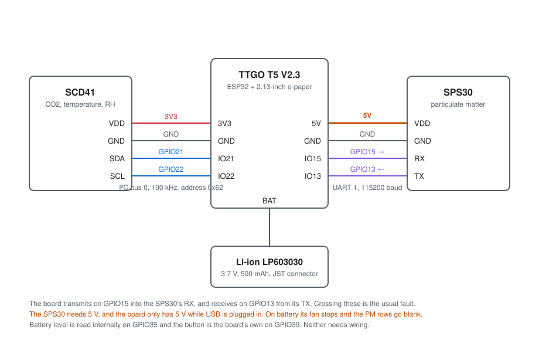
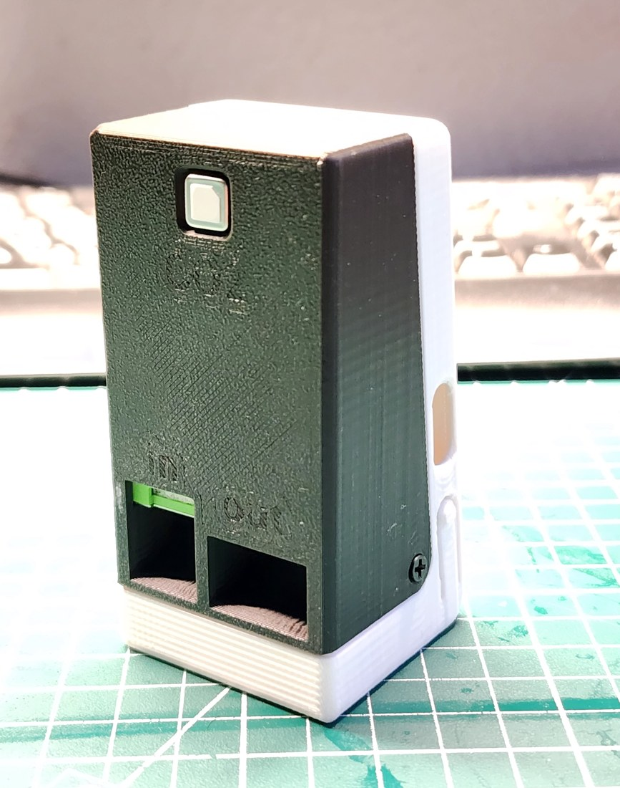

# Hardware

Parts, wiring and assembly. Eight wires, no circuit board.

## Parts

| Part | Notes |
|---|---|
| **LILYGO TTGO T5 V2.3** | The 2.13-inch e-paper version, 128 × 250 pixels, DEPG0213BN panel. The board already carries the display, a user button, a battery connector and a charger. **Check which panel your board has** — the T5 is sold with several, and the layout here assumes 128 × 250 |
| **Sensirion SCD41** | Any breakout. I²C address `0x62`. The SCD40 uses the same driver but is a cheaper, less accurate part |
| **Sensirion SPS30** | Wired over its **UART** interface, not I²C. It ships with a 5-pin JST-GH cable |
| **Li-ion LP603030** | About 500 mAh with a JST connector to match the board. Buy one **with a protection circuit** |
| **Printed case** | [thing:7273904](https://www.thingiverse.com/thing:7273904), plus four M3 screws |

## Wiring

  

| From | To | GPIO |
|---|---|---|
| SCD41 `VDD` | T5 `3V3` | — |
| SCD41 `GND` | T5 `GND` | — |
| SCD41 `SDA` | T5 `IO21` | GPIO21 |
| SCD41 `SCL` | T5 `IO22` | GPIO22 |
| SPS30 `VDD` | T5 `5V` | — |
| SPS30 `GND` | T5 `GND` | — |
| SPS30 `RX` | T5 `IO15` | GPIO15 |
| SPS30 `TX` | T5 `IO13` | GPIO13 |
| Cell | T5 battery connector | — |

The board **transmits** on GPIO15 into the SPS30's RX pin, and **receives** on
GPIO13 from its TX pin. Swapping those two is the usual reason a freshly built
box shows `SPS OFF`.

The SPS30's own connector also has a `SEL` pin. Leave it unconnected for UART
mode; tying it to ground is what selects I²C, which this firmware does not use.

Nothing is wired for the battery gauge or the button. The cell voltage reaches
GPIO35 through a divider already on the board, and the button on GPIO39 is the
board's own.

## The 5 V problem

The SPS30 needs 5 V for its fan and laser. The T5 has 5 V only while a USB cable
is plugged in — the battery is 3.7 V and there is no boost converter.

So on battery the SPS30 simply stops, the firmware sees no particulate frames,
and the display shows `SPS OFF (Battery)` in place of the three PM rows. CO2,
temperature, humidity and the battery percentage carry on.

This is worth knowing rather than working around: it is exactly what makes the
cell useful, because it lets you carry the box outside to give the CO2 sensor a
look at fresh air. See
[measurement.md](measurement.md#calibrating-the-co2-sensor).

## Assembly order

1. Fit the SPS30 into the rear shell first. Its inlet and outlet have to line up
   with the slots, and nothing else in the box is as fussy about position.

  

2. Solder the four sensor wires to the T5's header **before** the board goes in.
   Standard header pins are too long to close the case: use short pins, solder
   the wires straight to the pads, or bend the pins over to about 45°.
3. Connect the cell to the board's JST socket. Check the polarity against the
   board's silkscreen — JST leads are not standardised and a reversed cell will
   destroy the charger.
4. Test the whole thing on the bench before closing it up. You should get the
   splash screen, then numbers about thirty seconds later.
5. Cut the sacrificial bridge out of the printed button, drop it into its slot,
   and close the case with four M3 screws.

## The case

Both shells, the button bar, the rubber foot and the STEP source are on
Thingiverse: [thing:7273904](https://www.thingiverse.com/thing:7273904).
Assembled it is 46 × 90 × 44 mm. Print at 0.16 mm with no supports.

The button is printed over a 0.4 mm bridge so that it needs no supports of its
own. Cut it out after printing or the button will not move.

## Charging

The T5 charges the cell whenever USB is connected, using its own charger. There
is no switch: plugging in charges and powers the box at once, and that is also
the only state in which the particulate sensor runs.

## Related

- [flashing.md](flashing.md) — getting the firmware onto the board
- [troubleshooting.md](troubleshooting.md) — when a sensor does not appear
